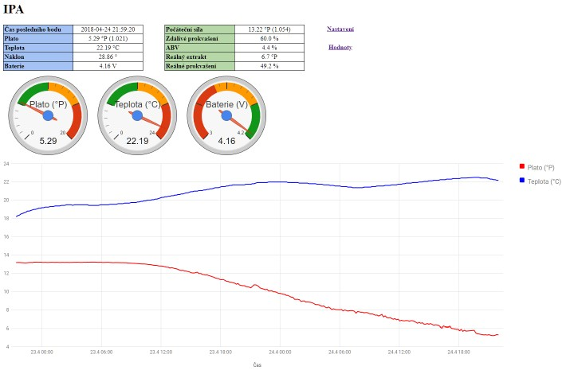

# iSpindel #

Jednoduchý web pro zobrazení a správu měření teploty a Plato piva z iSpindel https://github.com/universam1/iSpindel. Podporováno je zobrazení dat pouze z jednoho měřiče.

## Licence ##

Copyright © 2018, Martin Dušek. Všechna práva vyhrazena.  
Redistribuce a použití zdrojových i binárních forem díla, v původním i upravovaném tvaru, jsou povoleny za následujících podmínek:  
  
1. Šířený zdrojový kód musí obsahovat výše uvedenou informaci o copyrightu, tento seznam podmínek a níže uvedené zřeknutí se odpovědnosti.
2. Šířený binární tvar musí nést výše uvedenou informaci o copyrightu, tento seznam podmínek a níže uvedené zřeknutí se odpovědnosti ve své dokumentaci a/nebo dalších poskytovaných materiálech.
3. Ani jméno vlastníka práv, ani jména přispěvatelů nemohou být použita při podpoře nebo právních aktech souvisejících s produkty odvozenými z tohoto softwaru bez výslovného písemného povolení.
  
TENTO SOFTWARE JE POSKYTOVÁN DRŽITELEM LICENCE A JEHO PŘISPĚVATELI „JAK STOJÍ A LEŽÍ“ A JAKÉKOLIV VÝSLOVNÉ NEBO PŘEDPOKLÁDANÉ ZÁRUKY VČETNĚ, ALE NEJEN, PŘEDPOKLÁDANÝCH OBCHODNÍCH ZÁRUK A ZÁRUKY VHODNOSTI PRO JAKÝKOLIV ÚČEL JSOU POPŘENY. DRŽITEL, ANI PŘISPĚVATELÉ NEBUDOU V ŽÁDNÉM PŘÍPADĚ ODPOVĚDNI ZA JAKÉKOLIV PŘÍMÉ, NEPŘÍMÉ, NÁHODNÉ, ZVLÁŠTNÍ, PŘÍKLADNÉ NEBO VYPLÝVAJÍCÍ ŠKODY (VČETNĚ, ALE NEJEN, ŠKOD VZNIKLÝCH NARUŠENÍM DODÁVEK ZBOŽÍ NEBO SLUŽEB; ZTRÁTOU POUŽITELNOSTI, DAT NEBO ZISKŮ; NEBO PŘERUŠENÍM OBCHODNÍ ČINNOSTI) JAKKOLIV ZPŮSOBENÉ NA ZÁKLADĚ JAKÉKOLIV TEORIE O ZODPOVĚDNOSTI, AŤ UŽ PLYNOUCÍ Z JINÉHO SMLUVNÍHO VZTAHU, URČITÉ ZODPOVĚDNOSTI NEBO PŘEČINU (VČETNĚ NEDBALOSTI) NA JAKÉMKOLIV ZPŮSOBU POUŽITÍ TOHOTO SOFTWARE, I V PŘÍPADĚ, ŽE DRŽITEL PRÁV BYL UPOZORNĚN NA MOŽNOST TAKOVÝCH ŠKOD.

https://opensource.org/licenses/BSD-3-Clause

## Systémové požadavky ##

* MySQL
* Apache
* PHP

## Instalace ##

### 1. Vytvoření databáze ###

Pokud na vašem hostingu nemůžete přidat novou databázi, tak vytvořte pouze tabulky v již existující databázi.

    --
    -- 1. Databáze
	--
    CREATE DATABASE IF NOT EXISTS `beer` DEFAULT CHARACTER SET utf8 COLLATE utf8_czech_ci;
    USE `beer`;
	
	--
	-- 2. Tabulky
	--
    CREATE TABLE `batch` (
      `pk_id` int(11) NOT NULL AUTO_INCREMENT,
      `name` varchar(128) COLLATE utf8_czech_ci NOT NULL,
      `plato` float NOT NULL,
      `timestamp` timestamp NOT NULL DEFAULT CURRENT_TIMESTAMP,
      PRIMARY KEY (`pk_id`)
    ) DEFAULT CHARSET=utf8 COLLATE=utf8_czech_ci;
    CREATE TABLE `ispindel` (
      `pk_id` int(11) NOT NULL AUTO_INCREMENT,
      `name` varchar(64) COLLATE utf8_czech_ci NOT NULL,
      `ID` int(11) NOT NULL,
      `token` varchar(128) COLLATE utf8_czech_ci NOT NULL,
      `angle` float NOT NULL,
      `temperature` float NOT NULL,
      `battery` float NOT NULL,
      `gravity` float NOT NULL,
      `timestamp` timestamp NOT NULL DEFAULT CURRENT_TIMESTAMP,
      PRIMARY KEY (`pk_id`)
    ) DEFAULT CHARSET=utf8 COLLATE=utf8_czech_ci;
	
### 2. PHP skripty ###

* Stáhněte si všechny PHP soubory z repositáře
* Otevřete soubor db.php a upravte nastavení databáze (adresa serveru, uživatelské jméno, heslo, jméno databáze).
* Všechny soubory PHP nahrajte na váš webový server

### 3. Nastavení iSpindel ###

* Service Type = HTTP
* Server Address = http://adresa (váš webový server - například http://10.0.0.1)
* Server Port = 80
* Server URL = http://adresa/iSpindel.php

### 4. Web ###

* **index.php** - výchozí stránka s kvašením piva
* **Nastavení** - zde můžete přidat/upravit várku (chráněno jménem a heslem - stejné jako u databáze v `db.php`). U piva je třeba zadat název a volitelně počáteční hodnotu plato
(pokud necháte prázdné nebo nastavíte 0, tak se hodnota vypočíta automaticky jako maximum z naměřených hodnot). **Všechny příchozí měření z iSpindel se berou jako součast nejnovějšího piva!**
* **Hodnoty** - zobrazení hodnot s možností výmazu (opět chráněno heslem). Hodí se hlavně pro vymazání nepřesných hodnot po zapnutí iSpindel případně při sbírání deky, atd...